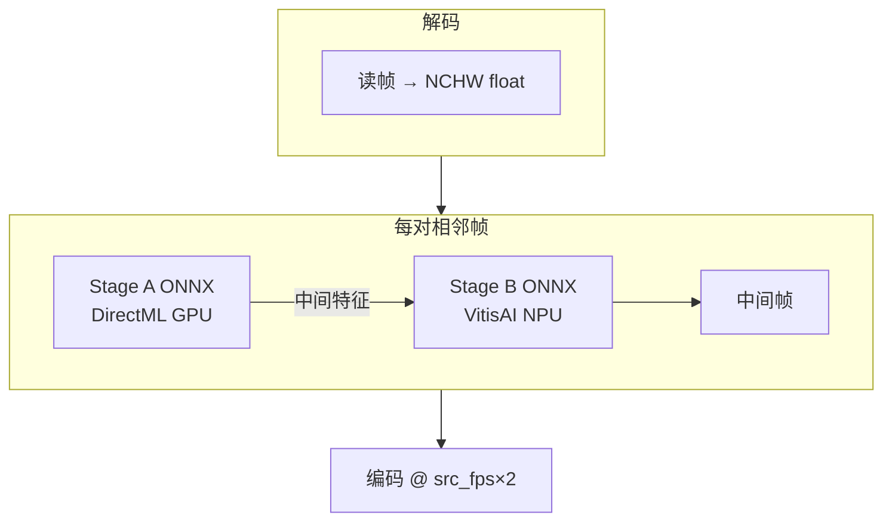
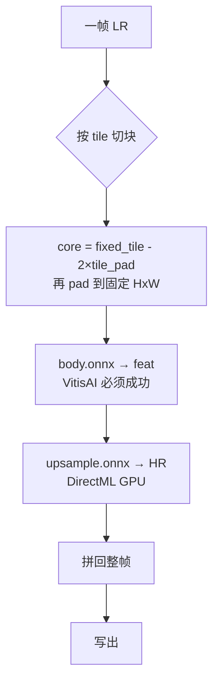

# Video4x — 统一超分 + 插帧

在 AMD Ryzen AI（RDNA iGPU + XDNA NPU）上用 **ONNX Runtime** 做视频增强：

| 算子 | 模型 | GPU+NPU（`split-pipeline`） |
|------|------|------------------------------|
| **插帧** | RIFE v4.26 | Stage A = DirectML，Stage B = VitisAI |
| **超分** | Real-ESRGAN `x2plus` / `x4plus` / `x4plus_anime` | Body = **必须** VitisAI，Upsample = DirectML |

包名：`video4x`（旧名 `rife-amd` / `rife_amd` 仍作兼容入口）。

插帧输出帧率 = **片源 FPS × 2**（自动探测，例如 24→48、30→60）。

---

## 安装（Windows / Ryzen AI）

**推荐运行时：conda `ryzen-ai-1.7.1`**（自带 VitisAI + DirectML）。

```powershell
cd D:\Gits\MaintainAll\apps\video4xinterpolation
powershell -ExecutionPolicy Bypass -File setup\windows\install.ps1   # 装进 conda，不建 .venv
conda activate ryzen-ai-1.7.1
$env:RYZEN_AI_INSTALLATION_PATH = 'C:\Program Files\RyzenAI\1.7.1'
$env:PYTHONUNBUFFERED = '1'
```

可选项目 venv：`.\setup\windows\install.ps1 -UseVenv`（通常没有 VitisAI，无法跑 NPU）。

---

## 模型准备

```powershell
# 下载权重（默认：rife + x2plus/x4plus/x4plus_anime）
video4x download
# 或只下某类
video4x download --models rife
video4x download --models x2plus

# 导出 ONNX（推理用）
video4x export rife -- --fixed-tiers
python scripts\quantize_rife.py          # Stage B 量化（NPU）
video4x export realesrgan --models x2plus,x4plus,x4plus_anime
# Real-ESRGAN 会额外导出 fixed/256x256、fixed/512x512 供 VitisAI
```

### 目录约定

```
models/
  RIFEv4.26_0921/          # 下载的 RIFE 权重（gitignore）
  realesrgan/
    .gitkeep               # 占位：让空目录可被 git 跟踪
    RealESRGAN_*.pth       # 权重（gitignore：*.pth）
  onnx/                    # 导出的 ONNX（gitignore）
    rife_*.onnx
    realesrgan/<model>/
      realesrgan_full.onnx
      realesrgan_body.onnx
      realesrgan_upsample.onnx
      fixed/256x256/...
      fixed/512x512/...
vitisai_cache/             # NPU 编译缓存（gitignore）
```

| 文件 / 目录 | 作用 | 是否入库 |
|-------------|------|----------|
| `models/realesrgan/.gitkeep` | 常规占位文件：git 不跟踪空目录，用它保留 `realesrgan/` 路径说明 | 可入库 |
| `models/realesrgan/*.pth` | PyTorch 权重 | 否 |
| `models/onnx/` | 导出的推理图 | 否 |
| `vitisai_cache/` | VitisAI 首次编译产物 | 否 |
| `original-*-signature.txt` | 运行时落在 CWD 的指纹文件（见下） | 否 |

### `original-info-signature.txt` / `original-model-signature.txt`

这两个文件是 **NPU / ORT 相关工具在进程当前工作目录写出的指纹**（各一行 32 位 hex），**不是** `video4x` 源码的一部分，代码也不读取它们。常见于 VitisAI 编译 / 探测期间。已加入 `.gitignore`，可直接删除，不影响推理。

---

## 实现方式

### 总览：EnhanceJob 流水线


- `--ops` / `--order` 决定算子集合与顺序（`interpolate` / `superresolve`）。
- 多步时中间结果写系统临时 mp4，最后一步写 `-o`。
- 帧率：从片源探测；插帧后工作 FPS = 源 × 2。

### 插帧（RIFE）`split-pipeline`



- Stage A / B 为切分后的固定分辨率 ONNX；Stage B 优先量化图。
- 启动时对 Stage B 做 **子进程 VitisAI probe**；失败则该 stage 回退（插帧允许），进度里可见 `gpu_hits` / `npu_hits`。

### 超分（Real-ESRGAN）`split-pipeline`



要点：

1. **固定 tile**：优先 `fixed/256x256`（也可用 512）。动态尺寸 NPU 易失败。
2. **`tile_pad`**：有固定 tile 时，核心块大小 = `fixed_tile - 2*pad`，避免 pad 后超过固定输入。
3. **禁止 body 静默回退 DML**：probe / session 不是 VitisAI 时直接 `RuntimeError`（保证 GPU+NPU 协同，而不是“看起来像 split、实际全在 GPU”）。
4. **仅缺 body/upsample 文件时** 才回退整图 `full` + single-ep。
5. **`cache_key`**：由 ONNX 路径派生（如 `x2plus_fixed_256x256_realesrgan_body`），避免多个同名 `realesrgan_body.onnx` 污染 `vitisai_cache/`。

### 插帧 `dual-stream` + 共享内存 IOBinding

| 模式 | 行为 |
|------|------|
| `dual-stream`（无 IOBinding） | 跨相邻 pair：**Stage A(N+1)∥Stage B(N)** 线程重叠（Windows）；单 pair 仍顺序 A→B |
| `--memory shared` / IOBinding | 预分配 pinned `OrtValue` 双缓冲；中间张量 A→B **同一 `data_ptr`**，避免每帧 numpy 往返 |
| 二者同时开 | **仍是 GPU+NPU 协同**（A=Dml，B=VitisAI）；但 DirectML 与 `run_with_iobinding` 不能安全并发，故重叠改为**顺序 A→B**，`fallback_reason` 会写明 |

固定档：片源 pad 到 32 对齐后须精确匹配 `736x1280` / `1088x1920`。VitisAI **不能**加载动态 H/W（`-1`）ONNX。`video4x run` 在知道分辨率后再绑定 fixed（勿在 init 时用动态图探 NPU）。

短片冒烟（前 N 帧、强制 fixed）：

```powershell
python scripts\smoke_short_video.py -i in.mp4 -o tmp\smoke.mp4 `
  --max-frames 36 --backend dual-stream --memory shared `
  --fixed-tier 1088x1920 --use-iobinding on
```

### Backend 对照

| Backend | 插帧 | 超分 |
|---------|------|------|
| `split-pipeline` | A=GPU + B=NPU（顺序） | body=**NPU 必选** + upsample=GPU |
| `dual-stream` | 同上 EP；无 IOBinding 时可 A∥B 重叠 | （插帧专用） |
| `single-ep` | 单 session | 整图 `realesrgan_full.onnx` |
| `cpu-baseline` | CPU | 用 single-ep + CPU EP |

进度行示例：`models=fixed+quant`、`ep=[stage_a=Dml,stage_b=VitisAI]` 或 `ep=[body=VitisAI,upsample=Dml]`、`gpu_hits` / `npu_hits`、`mem=shared`。

### ORT 注意（Ryzen AI conda）

conda 里必须是 **`onnxruntime-vitisai`**（providers 含 `VitisAI` + `Dml`）。若 `pip install` 又装回官方 `onnxruntime`，会只剩 CPU：

```powershell
pip uninstall onnxruntime onnxruntime-directml -y
pip install --force-reinstall --no-deps "C:\Program Files\RyzenAI\1.7.1\onnxruntime_vitisai-1.23.3-cp312-cp312-win_amd64.whl"
python -c "import onnxruntime as ort; print(ort.get_available_providers())"
```

`pip install -e .` 时建议加 `--no-deps`，避免再次拉官方 ORT。

---

## 案例命令

环境变量（每次新开终端建议设置）：

```powershell
conda activate ryzen-ai-1.7.1
$env:RYZEN_AI_INSTALLATION_PATH = 'C:\Program Files\RyzenAI\1.7.1'
cd D:\Gits\MaintainAll\apps\video4xinterpolation
# 或: . .\setup\windows\env.ps1
```

### 仅插帧（GPU+NPU）

```powershell
# 顺序 split（默认）
video4x run -i in.mp4 -o in_rife48.mp4 `
  --ops interpolate --platform windows `
  --fi-backend split-pipeline

# dual-stream + 共享内存零拷贝（IOBinding 开时不做 A∥B 重叠）
video4x run -i in.mp4 -o in_rife48.mp4 `
  --ops interpolate --fi-backend dual-stream --memory shared
```

`[init]` 应见 `models=fixed+quant` 与 `ep=[stage_a=Dml…, stage_b=VitisAI…]`。若出现 `models=dynamic` 或两边 CPU，先查 ORT providers / 固定档是否匹配。


### 仅超分（GPU+NPU，x2 → 约 4K@1080p 源）

```powershell
video4x run -i in_rife48.mp4 -o in_rife48_4k.mp4 `
  --ops superresolve --platform windows `
  --sr-model x2plus --sr-backend split-pipeline --tile 256
```

确认日志中有：`ep=[body=VitisAI,upsample=Dml]`，且 `npu_hits` 随帧增加。若 body 上不了 NPU，进程会报错退出（不会静默改用 DML）。

### 串联：先插帧再超分

```powershell
video4x run -i in.mp4 -o out_rife48_4k.mp4 `
  --ops interpolate,superresolve `
  --order interpolate,superresolve `
  --platform windows `
  --sr-model x2plus `
  --fi-backend split-pipeline --sr-backend split-pipeline `
  --tile 256
```

### 先超分再插帧

```powershell
video4x run -i in.mp4 -o out.mp4 `
  --ops superresolve,interpolate `
  --order superresolve,interpolate `
  --sr-model x4plus `
  --fi-backend split-pipeline --sr-backend split-pipeline
```

### 白海类短片（已验证路径）

```powershell
$dir = "C:\Users\Royen\OneDrive\创作\歌曲短片\白海\成果"

# 白海2：已有插帧结果时只跑超分
video4x run `
  -i (Join-Path $dir "白海2_rife48.mp4") `
  -o (Join-Path $dir "白海2_rife48_4k.mp4") `
  --ops superresolve --platform windows `
  --sr-model x2plus --sr-backend split-pipeline --tile 256

# 白海3：插帧 + 超分一条龙
video4x run `
  -i (Join-Path $dir "白海3.mp4") `
  -o (Join-Path $dir "白海3_rife48_4k.mp4") `
  --ops interpolate,superresolve --order interpolate,superresolve `
  --platform windows --sr-model x2plus `
  --fi-backend split-pipeline --sr-backend split-pipeline --tile 256
```

说明：1080p + tile 256 时，超分 body 在 NPU 上较慢（约数十秒/帧量级，视 tile 数而定）；首次该 `cache_key` 编译可能额外很久。

### TUI

```powershell
video4x tui
# 或
python scripts\tui.py
```

---

## Python API

```python
from video4x import EnhanceJob, EnhanceJobConfig, OpSpec
from pathlib import Path

cfg = EnhanceJobConfig(
    input_path=Path("in.mp4"),
    output_path=Path("out.mp4"),
    order=["interpolate", "superresolve"],
    interpolate=OpSpec(op="interpolate", backend="split-pipeline", platform="windows"),
    superresolve=OpSpec(
        op="superresolve",
        model="x2plus",
        backend="split-pipeline",
        platform="windows",
        tile=256,
    ),
)
EnhanceJob(cfg).run()
```

插帧引擎仍可用：

```python
from video4x import RifeInferenceEngine, InferenceConfig

with RifeInferenceEngine(InferenceConfig(mode="split-pipeline", platform="auto")) as engine:
    engine.interpolate_video("in.mp4", "out.mp4")
```

---

## 源码结构

```
src/video4x/
  runtime/          # EP 探测、OrtSession/IOBinding、memory、resources、video_io
    backends/       # split_pipeline / dual_stream / single_ep / vitisai_probe
  ops/interpolate/  # RIFE（lazy bind fixed-tier）
  ops/superresolve/ # Real-ESRGAN（engine / tile / backends / export）
  job/              # EnhanceJob + 可排序 Pipeline
  cli/main.py       # video4x 子命令
  tui/app.py        # Textual 薄壳
scripts/smoke_short_video.py  # 前 N 帧冒烟（可强制 fixed-tier / IOBinding）
```

兼容旧命令：`rife-interpolate`、`scripts\interpolate.py` 等仍可用。
