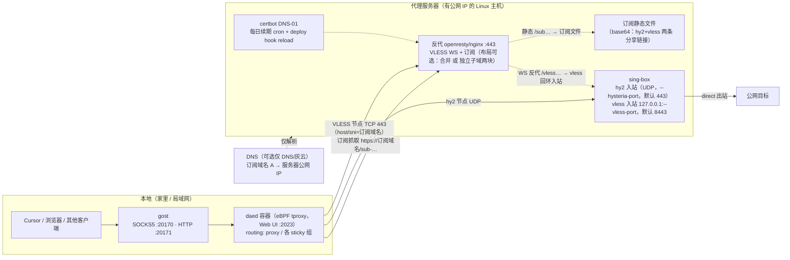

# deploy/proxy — 通用私有代理节点部署（sing-box + daed）

在任意一台有公网 IP 的 Linux 服务器上部署 **sing-box**，提供两个可导入 daed/dae 的私有节点：

| 协议 | 端口 | 传输 | 说明 |
|---|---|---|---|
| **Hysteria2** | UDP 端口（默认 443） | QUIC (h3) | 主协议，长距离/丢包场景吞吐最好，[Hysteria2](https://hy2.io/) 的 Brutal 拥塞控制适合跨境提速 |
| **VLESS + WebSocket + TLS** | TCP 443（经你的 nginx / OpenResty 反代） | WS over TLS | 备用协议，反代服务继续持有 443，只需你手动添加一个私密 `location` / `server` 块 |

dae 原生支持这两种协议，见
[dae proxy protocols](https://github.com/daeuniverse/dae/blob/main/docs/en/proxy-protocols.md)。
脚本本身**不修改 nginx/OpenResty**：既打印 nginx 的 `location` 片段，也打印可直接放进
`http{}` 的完整 **OpenResty `server` 块**（`deploy/proxy/openresty/`），由你自行粘贴并 reload。

## 总体架构



架构要点：

- **两个节点**可在同一个 sing-box 进程：hy2（UDP，不经反代）+ vless（TCP 443 →
  反代 → 本机回环 vless 入站 → sing-box 出站 direct）。
- **443 的 server 布局有两种可选方案**（仓库都支持，见下文"server 布局方案"）：
  方案 A = VLESS 与订阅合并进同一个有效证书 `server` 块；方案 B = 各自独立子域、
  拆成两个 `server` 块（文件级分离）。两方案节点链接都用域名（host/sni）、**不带
  allowInsecure**，全局 `allow_insecure=false` 即可正常工作。
- **hy2 完全独立于反代**（UDP 直连 sing-box），两方案下都成立。
- **进程级共享点**：反代进程（VLESS 前端 + 订阅）、sing-box 进程（hy2 + vless
  入站）；需要更彻底隔离时分别拆独立实例/端口。
- DNS 仅解析（灰云）时流量直连不减速；hy2 是 UDP，无法走 CDN/反代代理，只能直连。

### 443 server 布局方案（两选一）

| | 方案 A：合并 | 方案 B：独立子域（拆分） |
|---|---|---|
| 结构 | 一个 `server` 块含 `/vless…` + `/sub…` 两个 location | VLESS、订阅各一个 `server` 块（不同子域，SNI 分流） |
| 模板 | `openresty/tls-server.conf.template` | `openresty/split-vless-server.conf.template` + `openresty/split-sub-server.conf.template` |
| 文件级独立性 | 无（同块同文件） | 有（删/停任一块互不影响） |
| 证书/域名 | 一个域名即可 | VLESS、订阅各一个子域（可同证书多 SAN 或各自证书） |
| 适用 | 追求最少域名/最省事 | 想单独停 VLESS 或订阅时不动另一个 |

节点链接（两方案相同风格）：`vless://…@<域名>:443?...&host=<域名>&sni=<域名>`，
订阅 URL：`https://<订阅子域>/sub-…`。

## 三个组件（边界说明）

| 组件 | 组成 | 说明 |
|---|---|---|
| **UDP 节点**（Hysteria2） | sing-box hy2 入站，公网 UDP 端口 | 不经反代；反代/订阅挂掉不影响它 |
| **TCP 节点**（VLESS+WS） | sing-box vless 入站(仅回环) + 反代 443 的 `/vless…` location | 依赖反代与 sing-box |
| **订阅**（[sub/](sub/README.md)） | 静态 base64 文件 + 反代 443 的 `/sub…` location | 只依赖反代；节点全停也能拉取 |

依赖边界：sing-box 一个进程可同时含 hy2 与 vless 两个入站（最简，配置见
`sing-box/config.json.template`）；也可以拆成两个实例分别只跑一种协议。反代 443
上的 server 布局**两方案自选**：合并（`openresty/tls-server.conf.template`，
一个块同域名证书）或拆分独立子域（`split-vless-server.conf.template` +
`split-sub-server.conf.template`，文件级分离）。进程级共享点：反代进程（VLESS
前端 + 订阅）、sing-box 进程（hy2 + vless 入站）；需进程级隔离时再各自独立部署
（详见 [sub/README.md](sub/README.md)）。

## 调研结论（简述）

- dae 支持 Hysteria2、VLESS(WS/TLS/gRPC/Reality)、Shadowsocks、TUIC、Juicity 等
  （[dae proxy protocols](https://github.com/daeuniverse/dae/blob/main/docs/en/proxy-protocols.md)）。
- Hysteria2 基于 QUIC，适合高丢包跨境链路，带宽利用率普遍优于 TCP 类协议
  （[Hysteria 2 vs VLESS Reality 对比](https://lunaire.app/en/blog/hysteria-2-vs-vless-reality)）。
- VLESS+Reality 是 TCP 类性能最优，但要求独占 TCP 443（需要 nginx 让位做 fallback）。
  本方案采用 **VLESS+WS+TLS 经 nginx/OpenResty 反代** 作为不改变 443 监听的 TCP 备线。
- 其它候选：Shadowsocks 2022 轻量但无 TLS 伪装；TUIC/Juicity 生态/维护热度略低；
  WireGuard/gost 不适合作为 daed 导入节点。最终选择 **sing-box**：单二进制同时跑两种协议，
  systemd 托管，配置统一。

## 快速开始

### 1. 只生成配置并预览（默认，不碰任何机器）

```bash
cd deploy/proxy
./scripts/deploy.sh
```

输出内容：

1. 渲染后的 `config.json`（sing-box 服务端配置）；
2. nginx `location` 片段 **和** OpenResty 完整 TLS server 块（VLESS WS + 订阅，同一域名证书）；
3. 两条导入链接（`hysteria2://` 与 `vless://`）。

参数：

```bash
./scripts/deploy.sh \
  --ip <服务器公网IP> \
  --sni <你的域名> \
  --cert-dir <远端证书目录> \
  --hysteria-port 443 \
  --vless-port 8443 \
  --tls-port 443 \
  --version 1.14.0
```

各参数也可用环境变量：`REMOTE_IP`、`SNI_DOMAIN`、`CERT_DIR`、`HYSTERIA_PORT`、
`VLESS_PORT`、`TLS_PORT`、`SING_BOX_VERSION`。

- 不传 `--ip` 时，导入链接里的地址显示为 `__SERVER_IP__`，按需替换。
- 不传 `--sni` 时，链接里会使用 IP 并带 `allowInsecure=1`；这通常需要 daed 允许 insecure，
  更适合内网或测试场景。公网建议提供域名和有效证书。

### 2. 安装 sing-box 到远端（可选）

```bash
./scripts/deploy.sh --install \
  --host <ssh别名或主机> \
  --ip <服务器公网IP> \
  --sni <你的域名> \
  --cert-dir <远端证书目录>
```

`--install` 只做：

1. SSH 登录远端，下载/安装 sing-box 到 `${BIN_DIR}`（默认 `/usr/local/bin`）；
2. 上传渲染好的 config 到 `${CONFIG_DIR}`（默认 `/etc/sing-box`）；
3. 安装 `sing-box.service` 并 `systemctl enable --now sing-box`；
4. 若 `--cert-dir` 未提供，自动在远端生成自签名证书（Hysteria2 使用，链接带 `insecure=1`）；
5. 打印 nginx/OpenResty 配置片段与导入链接。

它**不会**修改 nginx/OpenResty、不会 reload、不会安装任何反代片段。反代相关操作由你手动完成。

SSH 参数可通过 `SSH_ARGS` 环境变量覆盖，例如：

```bash
SSH_ARGS="-F $HOME/.ssh/config -o BatchMode=yes" \
  ./scripts/deploy.sh --install --host <ssh别名> --ip <公网IP>
```

### 3. 手动配置反代（nginx 或 OpenResty，仅 VLESS 备用线路需要）

**nginx：** 把脚本输出的 `location = /vless-...` 片段放进你域名的 **TLS server block**
（`listen 443 ssl` 的 server 中），然后：

```bash
nginx -t
systemctl reload nginx
```

**OpenResty：** 脚本会额外打印一个**完整的 `server` 块**（含 `listen 443 ssl` 与 WS
反代 location）。把它放进 OpenResty 的 `http{}`（可直接追加到 nginx.conf 的 `http {`
下，或存成独立文件再 `include`），然后：

```bash
# EL9（RHEL/Alma/Rocky/OpenCloudOS 等）安装示例：
dnf install -y https://openresty.org/package/openresty.repo
dnf install -y openresty
openresty -t
systemctl enable --now openresty
```

反代只负责 TLS 终止并反代 WebSocket 到本机 `127.0.0.1:<--vless-port>`
（默认 `8443`，用 `--vless-port` 调整）。模板中的证书路径默认复用 Hysteria2 的 TLS
材料：`--cert-dir` 的 `fullchain.pem`/`privkey.pem`，或自签名的 `server.crt`/`server.key`；
OpenResty master 以 root 读取，无需改属主。

模板末尾带一个 `location / { return 444; }` 兜底：除 VLESS 精确路径外一律断开连接，
避免暴露默认欢迎页/被扫描（`location =` 精确匹配优先，不影响 VLESS 路径）。

> 公网侧请确认安全组放行 TCP `<--tls-port>`（默认 443）与 UDP `<--hysteria-port>`。

## 把两个私有节点合成一个订阅（无需面板）

完整操作（含独立服务方案与隐私提示）见 **[sub/README.md](sub/README.md)**。
摘要：dae 订阅就是一个返回 base64 文本的 URL，静态文件即可，不需要 web 面板/
subconverter：

```bash
./scripts/make-subscription.sh import-links.txt   # -> import-links.txt.b64
```

然后把该文件暴露成一个 URL（推荐：OpenResty 独立 HTTP 端口 server 块，见
sub/README.md 方案 A），daed → Subscriptions 添加即可。

## 导入 daed

1. 打开 daed Web UI → **Nodes**（或见上方"合成订阅"，用 Subscriptions 一次性导入）。
2. 粘贴脚本输出的 `hysteria2://` 链接（主）与 `vless://` 链接（备）。
3. 在 **Groups** 里把导入的节点加入 `proxy` 组（或按需加入 sticky 组）。
4. 在 Nodes 里做延迟/健康测试，确认 `ALIVE`。
5. 本地经 gost 出口验证：

```bash
curl -x socks5://127.0.0.1:20170 -I -m 10 https://www.gstatic.com
```

## 证书与续期

- 提供 `--cert-dir` 时，Hysteria2 使用该目录下的 `fullchain.pem` / `privkey.pem`；
  证书续期后需要重启 sing-box 使其重新加载证书。
- 未提供 `--cert-dir` 时，远端安装会生成自签名证书；对应链接含 `insecure=1`。
  daed/dae 的 `allow_insecure` 为 false 时需先允许 insecure，或改用有效证书。
- 可选用 certbot deploy hook（需你的续期系统支持）：把
  `nginx/certbot-restart-sing-box.sh` 安装到 certbot 的 deploy-hook 目录，续期后自动重启
  sing-box 并 reload openresty/nginx（若存在）。用户级（`systemctl --user`）部署的
  sing-box 不在 hook 内处理，需手动 `systemctl --user restart sing-box`。

## 文件结构

```
deploy/proxy/
├── README.md                             # 本文档
├── .gitignore
├── sing-box/
│   ├── config.json.template              # 通用模板（占位符由 deploy.sh 渲染）
│   └── sing-box.service                  # systemd 单元
├── scripts/
│   ├── deploy.sh                         # 生成配置/链接；--install 时安装 sing-box
│   ├── install.sh                        # 远端安装脚本（只装 sing-box，不碰反代）
│   ├── make-subscription.sh              # 把链接文件合成单行 base64 订阅（无面板）
│   └── rotate.sh                         # 在代理服务器本机跑：换凭据+重建订阅（sudo APP_USER=… ./rotate.sh）
├── openresty/
│   ├── tls-server.conf.template           # 方案A：VLESS+订阅合并于一个 443 server 块
│   ├── split-vless-server.conf.template   # 方案B：VLESS 独立子域 server 块
│   └── split-sub-server.conf.template     # 方案B：订阅独立子域 server 块
├── sub/
│   └── README.md                         # 独立组件：把节点合成静态订阅（含独立服务方案）
└── nginx/
    ├── proxy-location.conf.template      # 输出给你的 nginx location 片段模板
    └── certbot-restart-sing-box.sh       # 可选：证书续期后重启 sing-box / reload 反代
```

## 常见问题

- **Hysteria2 节点不 ALIVE**：确认安全组/防火墙放行对应 UDP 端口；确认密码与 `sni`/`insecure`
  与链接一致；若用自签名证书，确认 daed 允许 insecure。
- **VLESS 节点 502/404**：确认你已把输出的 nginx `location` / OpenResty `server` 块放进
  正确的 TLS 监听并 reload；确认 `path` 与链接一致；确认 `systemctl status sing-box` 正常。
- **不想用 VLESS**：忽略反代片段，只导入 `hysteria2://` 链接即可。
- **端口冲突**：Hysteria2 的 UDP 端口可通过 `--hysteria-port` 调整；sing-box 的本地 VLESS
  TCP 监听端口可通过 `--vless-port` 调整；公网 TLS 端口通过 `--tls-port` 调整。
