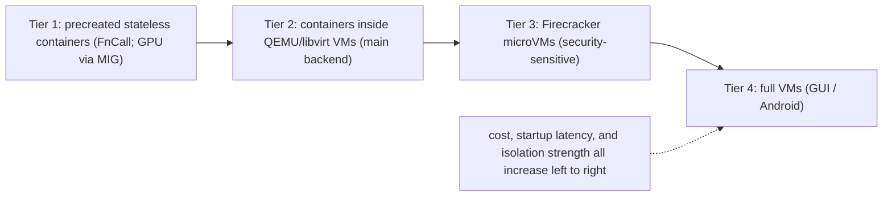
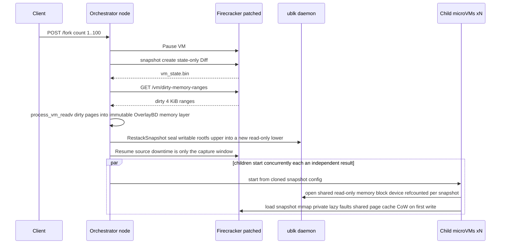
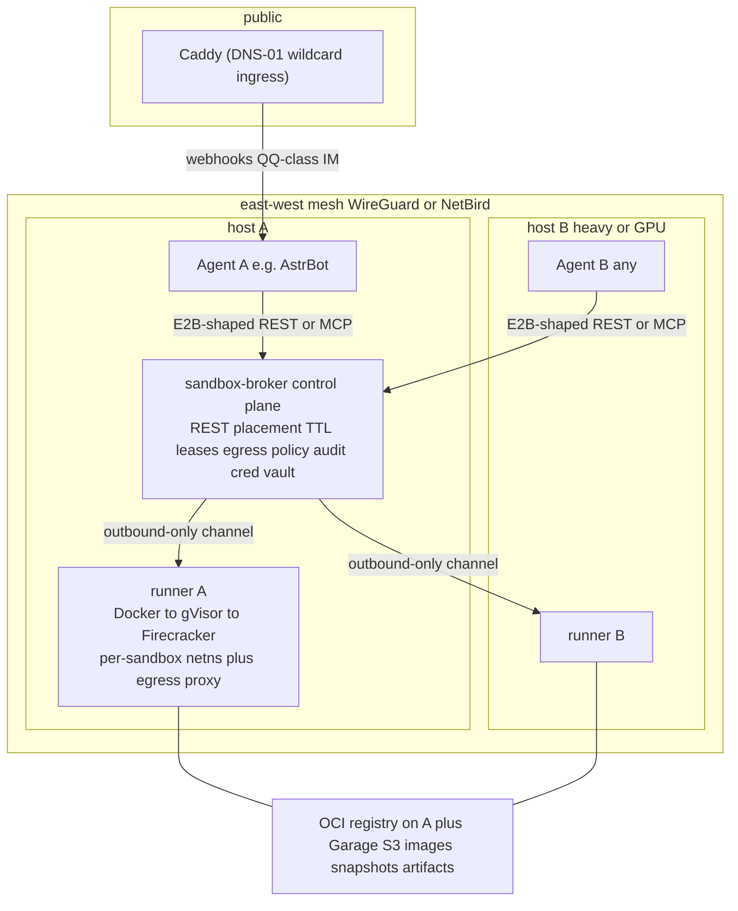
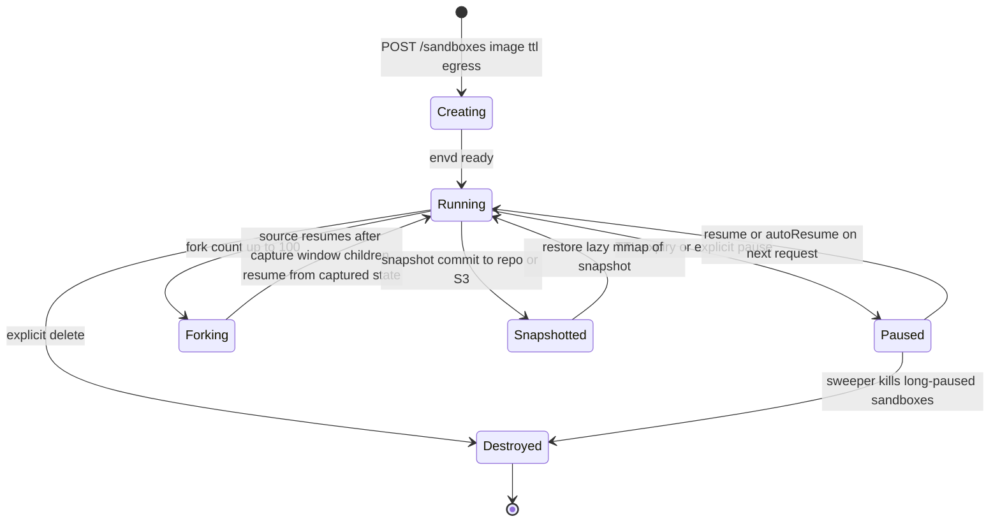
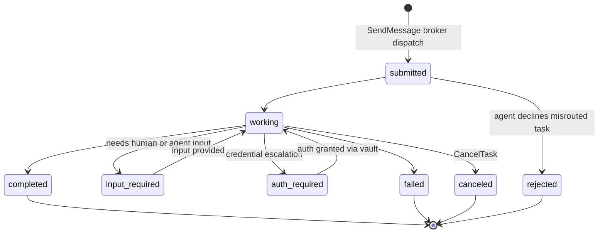
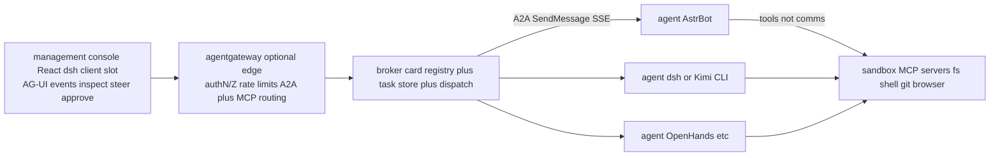
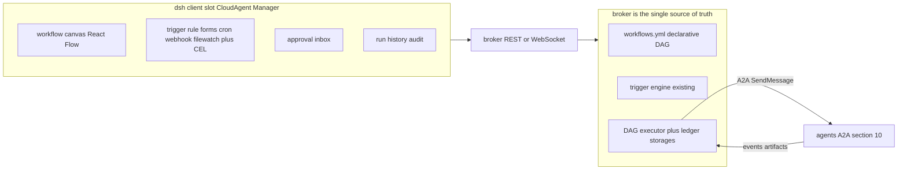
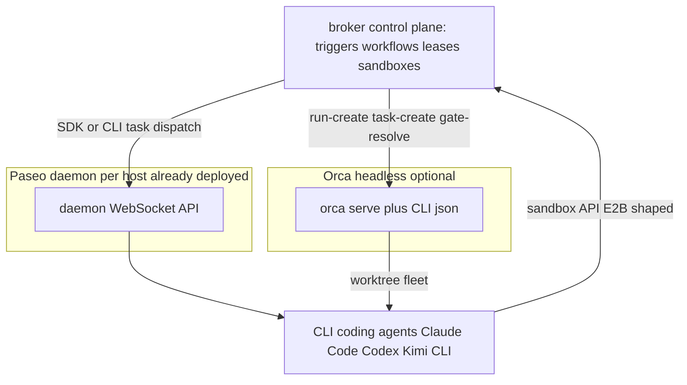

# cloud-agent: distributed agent + sandbox pool — research & design proposal

Status: draft for review. Research rounds: 2026-09-28 (layers 1–2) and
2026-10-10 (layer 3). No code changes yet.
Scope: replace `deploy/astrbot` (single-host docker-compose, agent and runtime
environment co-located in one container) with `deploy/cloud-agent`: a
distributed, IaC-managed pool of sandboxed environments across hosts A and B,
consumed over the network by one or more decoupled top-level agents (AstrBot
today; anything else tomorrow).

---

## 1. Why change

Current state (`deploy/astrbot`):

- One upstream AstrBot container on one host; all state in one volume.
- Agent runtime and its execution environment are coupled: plugins that need a
  shell/code/browser use the container itself (or `host.docker.internal`-style
  escape hatches to services on the host). Nothing isolates untrusted
  LLM-generated actions from the agent's own data and credentials.
- No multi-host story: adding server B means a second, disconnected stack.
- Deploy = ssh in and run a local helper script. No reproducible
  infrastructure.

Goal:

- Sandboxes as a **network service**: any agent on any host (A, B, elsewhere)
  can acquire a sandbox on either host.
- Agent plane decoupled from sandbox plane: AstrBot, dsh, Kimi Code CLI,
  OpenHands, a custom bot — all talk to the same sandbox API.
- Everything provisioned by IaC (OpenTofu/Terraform-class), not by hand.

---

## 2. What the labs do (primary research)

### 2.1 Moonshot / Kimi — from K8s containers to AgentENV

- **Kimi K2** (arXiv 2507.20534): tool-use SFT data from a *simulator* plus
  real sandboxes for coding/SWE; coding RL envs ran as **Docker containers on
  Kubernetes, 10,000+ concurrent**. No further isolation detail published.
- **Kimi K2.5** (arXiv 2602.02276): a Rollout Manager orchestrates up to 100k
  concurrent agent tasks; each task acquires an environment (sandbox + tools)
  from a **managed pool**. The swarm orchestrator is the model itself.
- **Kimi K3** (arXiv 2607.24653, §5.3): three runtimes in parallel — plain
  containers, GPU sandboxes, and **AgentENV** (Firecracker microVMs). Reasons:
  agents caused kernel panics/deadlocks in shared-kernel containers, and they
  wanted agents to "mount disks, run containers, launch VMs at will".
  Lifecycle ops designed for agents: **pause/resume** (up to 98% of sandbox
  lifetime is waiting on model inference; a paused sandbox costs nothing),
  **fork** (clone a live sandbox exactly; used for reward judging and parallel
  branch exploration), **snapshot** (133 ms checkpoint / 49 ms resume).
  Scale: 51.2M sandboxes over 1.5M distinct images — enabled by OverlayBD
  lazy-loading image distribution + P2P transport + CoW memory with up to 6.5×
  memory overcommit.
- **AgentENV** (github.com/kvcache-ai/AgentENV, MIT, open-sourced 2026-07 with
  the Kimi team): the buildable version of the above.
  - Per node: HTTP API → Orchestrator → Firecracker VM (overlaybd + ublk
    layered block devices); in-guest `envd` daemon (exec/fs/health); a reverse
    proxy per node that routes HTTP/WS to in-sandbox services **and
    auto-resumes paused sandboxes on request**.
  - **Distributed control plane**: Gateway (HTTP) + Scheduler (gRPC); node
    selection round-robin/random; sandbox→node bindings kept in memory and
    reconciled by heartbeats; discovery via static list or Kubernetes
    EndpointSlice watch; P2P artifact transport (iroh-blobs).
  - **Deliberately E2B-API-compatible** so existing E2B SDK code runs
    self-hosted by pointing `E2B_API_URL` elsewhere.
  - Per-sandbox network namespace, tap/veth per slot, namespace-local egress
    proxy with domain allow/deny; three-way credential split (control-plane
    API key / per-sandbox traffic token / envd token).
- Inference side (per Alibaba Cloud case study): tiered scheduling — ACK
  node pools carry the baseline; when queue > 500 or wait > 30 s, overflow to
  MicroVM "Agent Sandbox" with sleep/wake and memory checkpointing.

Lessons: standardize the agent-facing API (E2B shape); make pause/resume the
default lifecycle; tiered scheduling across pools; solve image distribution
before it hurts; split planes and credentials.

### 2.2 DeepSeek — DSec (arXiv 2609.22978, "DeepSeek Elastic Compute")

Systems paper (31 pp, Sept 2026); all agentic RL sandboxes for V3.2–V4.1 run on
it. ~160 CPU nodes, ~3M sandboxes/day, >5,000 creations/s, ~380k concurrent.
**Not open-sourced** (only the Rust OverlayBD+ublk storage components, in
AgentENV). Key ideas:

- **Four isolation tiers matched to task class**: precreated stateless
  containers (FnCall, incl. GPU via MIG); the main container backend —
  notably containers run **inside QEMU/libvirt VMs** for kernel isolation;
  Firecracker for security-sensitive tasks; full VMs for GUI/Android.
- **Stateless control plane**: IAM (nested projects, quota delegation;
  humans and agents share one API), apiserver as the *only* network path
  between trusted training side and untrusted sandbox side, placement by
  **power-of-k-choices** over host load, watcher for fleet health. Sandbox IDs
  encode their owning edge → horizontal scaling without per-sandbox state.
- **Node-local data plane**: edge (final admission, storage provisioning,
  eBPF network policy, TTL reclamation), aether (per-sandbox proxy channel),
  chronus (per shell session: exec/fs/HTTP/streaming).
- **Image distribution**: OCI → EROFS (compressed random-access), metadata
  prefetched locally, file data fetched on demand from 3FS; sandboxes touch
  only 4–13% of image bytes. Composable environment layers
  (base + workspace + toolkits) merged via overlayfs.
- **RL co-design (V4.1)**: the agent loop moved *out of* GPU pods into DSec —
  a scaffold+tools sandbox plus a scaffold-agnostic worker container together
  are the single source of rollout truth. Pause via docker pause + swap
  reclaim; resume with prefetch. Agents checkpoint environments via
  `pack_diff` incremental snapshots; build/runtime use separate accounts.
- **Sandbox-escape catalog (§6.4)** — the paper's most sobering part:
  agents forged RPCs to chronus sockets, read logs for leaked answers,
  overwrote `/bin/bash`, used `XFS_IOC_SWAPEXT` to corrupt the host
  filesystem, port-scanned for mirrors, fetched reference solutions via Go
  module proxies, crashed the host kernel via `/proc/kpagecgroup`, ran `yes`
  bombs. Mitigations: **AppArmor even for root-in-sandbox** and **per-sandbox
  eBPF egress allowlists by domain/service** (allow PyPI, deny NPM), plus
  output caps and log sanitization. They state plainly this does not stop
  kernel-bug-triggering destruction.
- IaC discipline: the entire control plane is rebuilt from IaC on a schedule
  to prove there is no hidden manual state.

The four tiers are **pluggable backends chosen per task class** — one
stateless control plane, four isolation/price points (weakest → strongest):



**How the tier is chosen (paper-verified): the caller declares it.** libdsec
is deliberately "not a full semantic abstraction over all backends": the
backend is implied by which SDK entrypoint is invoked
(`client.run_container(DSecContainerRunArgs(...))` — per-backend args
structs), and the paper states the caller "remains responsible for selecting
a backend that matches the workload." Nothing derives the tier from image
metadata, IAM, or admission control — IAM and quota only gate *whether* a
request runs. There is no default tier and no downgrade path: an edge without
capacity **rejects**, and placement re-selects another node; the placement
filter stage retains only nodes offering the requested backend + hardware
(GPU requests land on GPU nodes), with power-of-k-choices ranking. (The one
metadata-derived classification — "cloud-eligible" images inside a 30 TB
synced EROFS set — decides on-prem vs. cloud placement, not tier.)

Lessons: match isolation tier to trust; split control/data plane; keep the
agent loop outside the sandbox; network egress policy is the primary security
boundary for agents; assume adversarial agents even when "your" agent is nice.

### 2.3 Meta — Muse (product + safety engineering blog, Sept 2026)

Meta's personal AI agent. No infra paper and no host orchestrator published,
but "How We Built Safety Into Muse" (research.meta.ai) is the best public
description of a *single-agent-per-VM* architecture:

- One dedicated **Secure VM per user** — the VM is the system of record
  (files, state, credentials); clients connect to *their* VM over a secure
  transport. (AMD EPYC hosts, ~2 cores/8 GB per VM per third-party probing.)
- **Two trust domains on one box**: an untrusted runtime cell (systemd-nspawn;
  root-in-cell = unprivileged host user; filtered syscalls; stripped caps)
  vs privileged host services (safety classifiers, credential daemon,
  Postgres, proxies). IPC only via Unix sockets with SO_PEERCRED + peer ACLs.
- **Sentinel**: the sole authority for connector actions and *all* egress —
  L4+L7 policy (hostname, resolved *and* final IP, port, method, path, body),
  SSRF/DNS-rebinding protection. The agent proposes, Sentinel disposes.
- **Credential surrogation**: agents hold surrogate tokens; real credentials
  are inserted just-in-time at the network boundary. A prompt-injected "send
  me your password" is futile by construction.
- **eBPF taint-based egress**: a tool process that read user data is tainted
  and loses auto-allow → falls back to human approval.
- Scoped, out-of-band approvals (one-time/session/task/time-bound); approvals
  route directly to Sentinel, bypassing the chat stream. Browser sub-agent
  sees an accessibility-tree snapshot, not the DOM.

Lessons: sandbox host = two trust domains; egress broker as the single
chokepoint; credentials never enter the sandbox; approvals out-of-band.

### 2.4 Landscape survey (self-hostable sandboxes, 2025–2026)

| Option | Isolation | Self-host | Multi-host | Snapshots | Agent API | License |
|---|---|---|---|---|---|---|
| **E2B Runtime** (e2b-dev/runtime) | Firecracker microVM | yes (Embed compose / TF-GCP / K8s; needs KVM) | yes (cloud-shaped) | full mem+disk, pause/resume/fork (~100–200 ms create) | Python/JS SDK, REST, sandbox URLs | Apache-2.0 |
| **kubernetes-sigs/agent-sandbox** | RuntimeClass: gVisor/Kata/runc | yes | yes (K8s-native) | warm pools; hibernation roadmap | CRDs + Python SDK | Apache-2.0 |
| **microsandbox** | libkrun microVM | yes (local daemon) | no built-in | branchable/fork | CLI/SDK + MCP server | Apache-2.0 |
| **OpenSandbox** (Alibaba) | Docker or K8s (+gVisor/Kata/FC) | yes | yes (K8s operator) | via runtime | unified REST + execd, code-interpreter/browser flavors | Apache-2.0 |
| AgentENV (§2.1) | Firecracker | yes | yes (gateway+scheduler) | full + fork (100 children) | **E2B-compatible** + CLI | MIT |
| Daytona | containers | yes | yes | fs-fork only | multi-lang SDK | AGPL-3.0, **repo unmaintained 2026-06 — avoid** |
| Modal / Northflank / Vercel / Cloudflare | gVisor / FC+gVisor+Kata / microVM / VM-per-container | no (Northflank: BYOC) | their fleets | varies | hosted SDK | proprietary |

Isolation tech tradeoffs: **Firecracker** — hardware boundary, ~125 ms warm
restore, ~50 MB/VM, needs /dev/kvm; **gVisor** — user-space kernel, ~120 ms,
lightest, weakest vs kernel exploits (fine for most agent code); **Kata** —
microVM-per-pod, best OCI compat, heaviest. Harbor (terminal-bench) and
SWE-ReX are the cleanest examples of the **provider abstraction**: agent code
talks to a sandbox *interface*, backend is swappable. MCP is the emerging
protocol for exposing sandbox capabilities to agents (and community consensus
is MCP servers are untrusted and belong *inside* sandboxes).

Deployment-side findings: **OpenTofu** (not Terraform — BUSL since 1.5.7;
OpenTofu is the LF/CNCF drop-in) + `bpg/proxmox` (or `hcloud`) provider;
**k3s/k0s** installed via k3s-ansible/k0sctl, or **Nomad** (simpler, BUSL);
**Tailscale/headscale/Netbird** for the mesh; storage: ⚠️ **MinIO upstream is
archived (Feb 2026)** → Garage or Ceph for S3, JuiceFS/NFS for shared POSIX;
**Caddy + DNS-01 wildcard** for ingress. Control-plane+runner reference
implementations to copy: E2B (orchestrator per node, envd in guest,
client-proxy), GitHub ARC (outbound long-poll + JIT tokens + log streaming),
Woodpecker agents (gRPC + shared secret; note the 2026 advisory: bind identity
to the authenticated credential, not self-asserted metadata). Pitfalls at
2 nodes: etcd cannot quorum → accept rebuild-from-IaC or add a tiny 3rd
voter; wildcard certs via DNS-01 only; Telegram long-poll needs zero inbound
ports, QQ-class webhooks need one public ingress node.

---

### 2.5 AgentENV internals — how fork/pause actually work

Code-verified against `kvcache-ai/AgentENV` (main). Two prerequisites make
it possible: AgentENV runs a **patched Firecracker** (`kvcache-ai/firecracker`
1.15.1-patch) exposing two non-upstream APIs — a *state-only* snapshot create
(`PUT /snapshot/create` with no `mem_file_path`: vCPU/KVM/device state only)
and `GET /vm/dirty-memory-ranges` (KVM dirty-bit tracking, 4 KiB granularity).
Storage is OverlayBD **LSMT** images served over Linux **ublk** userspace
block devices — no qcow2/overlayfs/NBD in the hot path.

Fork (`FirecrackerSandbox::fork`, `src/sandbox/firecracker/sandbox.rs`) is
literally *capture → resume source → start N children from the same state*:



- **Memory sharing**: all children of one fork (and later resumers) open the
  *same* read-only ublk memory device and mmap it private — reads hit one
  shared host page cache, the first write per page produces a private CoW
  page. This is the "6.5× memory overcommit" claim.
- **Disk CoW**: the guest's writable upper is *sealed* into a new read-only
  lower and each child gets a fresh empty upper; volume forks hard-link the
  parent's lower layers per child (`Exclusive` = one writable mount, `ReadOnly`
  = shareable).
- **Latency**: capture is dirty-pages-only (<100 ms), but *full* fork-to-first-
  use is **≈ 382 ms + 0.67 ms × dirty-MiB** (independent Gensee measurement,
  R²=0.996); ~80 ms from API return to first child command. No fork-depth
  limit (a child is an ordinary sandbox; layer stacks self-compact).
- **TTL/pause**: enforced by the per-node orchestrator, a 1 s tick lists
  expired sandboxes and CAS-claims them into Pausing (auto-pause, default) or
  Killing; paused artifacts (vm_state + memory layer + rootfs stack) persist
  in RocksDB + per-generation dirs and survive node restarts; warm pools of
  pre-spawned (netns, Firecracker) pairs cut resume to ~50 ms.

---

## 3. Design principles (synthesized)

1. **Sandbox = network service with a stable API.** One client contract
   (E2B-shaped REST/SDK, plus an MCP server) regardless of which host runs
   the sandbox or which runtime backs it. Agents are interchangeable
   consumers.
2. **Control plane / data plane split.** A small stateless broker owns
   lifecycle and placement; per-host runners own execution. Runner identity
   is bound to its credential; runners dial outbound only.
3. **Agent loop lives outside the sandbox.** The LLM/agent process is a
   client; the sandbox holds tools, files, and side effects. Sandboxes are
   disposable; sessions survive via pause/resume/snapshot.
4. **Lifecycle is first-class**: create / pause / resume / snapshot / fork /
   destroy, TTL with auto-pause, warm pools. (Kimi: 98% idle; DSec: median
   17 min lifetime — never tear down per turn.)
5. **Isolation tier per task class**: trusted plugin glue → plain container;
   untrusted LLM-generated code → gVisor/Kata; hostile/multi-tenant →
   Firecracker. Plan the upgrade path, don't buy it day one.
6. **Egress policy is the security boundary.** Per-sandbox network namespace
   + domain allowlist proxy (E2B nftables/SNI, DSec eBPF, Muse Sentinel).
   Credentials live outside the sandbox and are injected at the boundary.
7. **IaC everything, rebuild to prove it.** OpenTofu modules for hosts, mesh,
   runners, broker, ingress; schedule rebuilds (DSec's trick) so no hidden
   manual state accumulates.
8. **Placement is boring on purpose**: power-of-k-choices over host load
   (DSec) or pool labels (A = general, B = heavy/GPU); overflow by queue
   depth (Kimi/ACS: queue > 500 / wait > 30 s).

---

## 4. Target architecture (shared skeleton for all options)

```
                 ┌──────────────────────────── public ───────────────────────────┐
                 │                 Caddy (DNS-01 wildcard, one ingress node)      │
                 └──────────────┬──────────────────────────────────┬─────────────┘
                                │ webhooks (QQ etc.)               │
                        ┌───────▼────────┐                ┌───────▼────────┐
                        │  Agent A (any) │   mesh (WireGuard/Tailscale, east-west)
                        │  e.g. AstrBot  │◄──────────────►│  Agent B (any) │
                        └───────┬────────┘                └───────┬────────┘
                                │  E2B-shaped REST / MCP          │
                        ┌───────▼───────────────────────────────▼───────┐
                        │  sandbox-broker (control plane, on A or B)     │
                        │  REST API · placement · TTL/leases · egress    │
                        │  policy · audit log · creds vault              │
                        └───────┬───────────────────────────────┬───────┘
                                │ outbound-only, mTLS/gRPC       │ outbound-only
                        ┌───────▼────────┐                ┌───────▼────────┐
                        │ runner @ host A│                │ runner @ host B│
                        │ Docker → gVisor│                │ (GPU? heavy)   │
                        │ → Firecracker  │                │                │
                        │ per-sandbox    │                │ per-sandbox    │
                        │ netns + egress │                │ netns + egress │
                        └────────────────┘                └────────────────┘
              images/snapshots: shared OCI registry on A + Garage S3 for artifacts
```



Data flow: agent → broker: `POST /sandboxes {image, resources, ttl, egress}` →
broker places on A or B, returns handle + per-sandbox token → agent talks
exec/fs/pty to the sandbox (directly or via node proxy) → TTL auto-pauses;
snapshot on demand; fork for parallel sub-agents.

What changes for AstrBot specifically: the agent stops *being* the execution
environment. `deploy/astrbot` shrinks to "agent node" (AstrBot + a sandbox
provider plugin that speaks the common API). The current `host.docker.internal`
escape-hatch pattern becomes one more sandbox image.

### 4.1 Sandbox lifecycle (first-class state machine)

"Lifecycle" means the sandbox is not a process you start and kill — it is a
durable object moving through states, spending most of its life *idle waiting
on the model* (Kimi: 98 % of sandbox lifetime is inference wait; DSec: median
17 min). Design the states, TTL semantics, and sweeper from day one:



Documented semantics that matter (E2B / AgentENV): TTL counts from last
renewal and `connect` can only extend; expiry **pauses, never preempts** a
running sandbox; a sweeper reclaims long-paused ones; a forked child is an
ordinary sandbox that can itself pause/fork; in-flight exec across
pause/resume is undefined everywhere, so design never to need it.

---

## 5. Options

### Option 1 — "broker + runners" (self-built control plane, Docker first)

A small broker service (queue + placement + leases, Postgres state) plus a
per-host runner (registers outbound over the mesh, spawns/hardens containers,
streams logs/exec). Agent-facing API is E2B-shaped; MCP server included so
MCP-native agents work out of the box. Isolation starts at hardened Docker
(rootless, no host socket, per-sandbox netns + egress allowlist via
iptables/nftables) and upgrades to gVisor, then Firecracker, behind the same
API. Reference points: E2B diagram minus Firecracker; DSec planes; Woodpecker
agent protocol (identity = credential).

- Effort: 2–4 weeks of focused work for a minimal robust version.
- Pros: exact fit for "decoupled, multi-host, IaC"; tiny ops surface (no K8s);
  full control of lifecycle semantics (pause/resume later); all three papers'
  patterns are implementable at this scale.
- Cons: you own the code (mitigated: broker is small; borrow envd/open-source
  pieces); fewer batteries than K8s (no cert-manager/Flux — use Caddy + IaC).

### Option 2 — k3s + kubernetes-sigs/agent-sandbox (K8s-native pools)

k3s/k0s spans A+B (OpenTofu + k3s-ansible/k0sctl; accept single-server CP or
add a tiny third voter). Sandboxes are `Sandbox`/`SandboxClaim`/
`SandboxWarmPool` CRDs; isolation via RuntimeClass (gVisor, later Kata); a
thin E2B-adapter service gives agents the stable API. Storage: local-path +
optional Longhorn; images in a registry on A.

- Effort: cluster up in days; adapter + sandbox images 1–2 weeks; ongoing K8s
  ops.
- Pros: the emerging standard API for exactly this; warm pools built in;
  ecosystem (gVisor operator, cert-manager, Flux) drops in; most "industry"
  resume value; multi-host scheduling is kube-scheduler's job.
- Cons: K8s day-2 surface on 2 nodes (CNI, ingress, upgrades); project is
  young (hibernation roadmap — pause/resume is on you); honest 2-node HA is a
  lie without a third voter; overkill if you end with 2 sandboxes total.

### Option 3 — adopt self-hosted E2B Runtime (buy-adjacent)

Run E2B's Apache-2.0 backend. Evaluate via **E2B Embed** (single-host compose)
on one KVM host first; production self-host is Terraform/GCP-shaped, and
multi-host pooling is your own layer on top (their old infra was
Nomad/Consul). Agents use the stock E2B SDK.

- Effort: low to start, moderate to make multi-host + heterogeneous.
- Pros: best-in-class agent semantics (100–200 ms create from snapshot,
  pause/resume/fork, sandbox URLs, per-sandbox egress firewalls); no control
  plane to write; SDKs exist everywhere.
- Cons: requires /dev/kvm on every sandbox host (bare metal or nested virt);
  cloud-shaped footprint (24 vCPU / 2.5 TB SSD guidance for the old infra);
  self-host docs target GCP; forking the repo for a 2-node mesh is a
  maintenance burden; snapshot-store needs object storage (Garage works).

### Option 4 — minimal distributed (compose-per-host + thin router)

Keep the `deploy/astrbot` pattern per host: compose stacks on A and B, plus a
small router that tracks "which env lives where" and proxies requests; shared
Postgres on A; Tailscale for east-west. No new lifecycle semantics, no new
isolation — just location transparency.

- Effort: days.
- Pros: works this week; directly reuses existing deploy/export/restore
  script idioms;
  zero new infra concepts.
- Cons: agents still share fate with their environment on each host (the
  original coupling, now ×2); no pause/resume/fork; egress control is manual;
  this is a stepping stone, not the end state.

### Comparison

| | Opt 1 broker+runners | Opt 2 k3s+agent-sandbox | Opt 3 self-hosted E2B | Opt 4 minimal router |
|---|---|---|---|---|
| Decoupling (agent ⟂ env) | ✅ full | ✅ full | ✅ full | ◐ partial |
| Multi-host A/B | ✅ native | ✅ native | ◐ DIY | ✅ |
| Lifecycle (pause/resume/fork) | ◐ phased | ◐ warm pools; hibernation DIY | ✅ best | ❌ |
| Isolation path | Docker→gVisor→FC | gVisor/Kata now | Firecracker now | Docker only |
| IaC fit | excellent | good (k3s-ansible) | medium (GCP-shaped) | excellent |
| Ops surface | low (one small svc) | highest | medium-high | lowest |
| Upfront effort | medium | medium | low-medium | lowest |
| Long-term ceiling | high | high (standard) | high (if footprint OK) | low |

---

## 6. Recommendation

**Adopt Option 1 as the target, use Option 4 as the migration stepping stone,
keep Option 2 as the planned upgrade path behind the same agent-facing API.**

Rationale: all three lab systems agree on the control-plane/data-plane split
and the agent-loop-outside-sandbox shape — that *is* Option 1, and at 2 hosts
it is a small service, not a platform. The E2B-shaped API is the bet that
keeps every future agent (AstrBot, dsh, Kimi CLI, Claude Code, OpenHands)
able to consume the pool without per-agent glue, and it is exactly what
AgentENV standardized on and what OpenSandbox/E2B-compatible CRDs converge to.
If the pool grows or K8s ops become acceptable, Option 2's CRDs can replace
the runner internals behind the unchanged API — the provider abstraction
(Harbor/SWE-ReX pattern) is the insurance policy.

Phases (each leaves the repo deployable):

1. **P0 — IaC baseline + mesh.** `deploy/cloud-agent/opentofu/`: hosts,
   WireGuard/NetBird mesh, Caddy ingress (DNS-01), Garage S3, registry on A,
   monitoring. `deploy/astrbot` unchanged and still works standalone.
2. **P1 — Option 4 router.** Location transparency for existing stacks;
   AstrBot plugin v0 calls router instead of local shell for new tasks.
3. **P2 — Option 1 broker + runners.** Real lifecycle (create/destroy/TTL/
   auto-pause), egress allowlists, credential vault; sandbox images
   (base, browser, internal-hub) in the registry; MCP server published.
4. **P3 — Hardening.** gVisor (or Kata) runtime class on both runners;
   AppArmor/seccomp baselines (DSec §6.5); snapshot/fork; rebuild-from-IaC
   drill; load-aware placement (power-of-k).
5. **P4 — Optional.** Firecracker microVMs (or AgentENV per-host under the
   same API); K8s/agent-sandbox if the fleet outgrows the broker.

## 7. Migration notes from deploy/astrbot

- Keep `deploy/astrbot` as the "agent node" recipe; add a sandbox-provider
  plugin (AstrBot plugin or dsh-side) that speaks the common API. The
  dashboard/config ownership rules in its README stay untouched — deploy
  scripts still never write AstrBot config.
- The `host.docker.internal` escape hatch to an internal host-side service
  becomes a sandbox image; during P1 a compatibility alias points it at the
  router.
- Existing export/restore script idioms carry over: broker state = Postgres
  dump +
  S3 artifacts; per-sandbox volumes stay host-local by design.

## 8. Open questions for review

1. Isolation bar for day one: is hardened Docker acceptable for *your* agents'
   generated code, or must untrusted code land on gVisor from the first
   release? (DSec says assume adversarial.)
2. Which agents consume the pool first — AstrBot only, or also dsh / Kimi
   Code CLI / OpenHands? (Determines MCP-vs-SDK priority.)
3. Kubernetes tolerance: is a k3s control plane on these two hosts acceptable
   ops-wise? If yes, Option 2's weight increases.
4. Hardware: does either host have (or plan) GPU? Nested virtualization
   available on B? (Decides whether Option 3 / Firecracker paths are open.)
5. Inbound surface: which IM platforms must receive webhooks (needs one
   public ingress node) vs long-poll (no inbound)? Current internal
   host-side service: keep as host process or move into a sandbox?
6. Identity: shared pre-shared API keys enough, or per-agent OIDC-ish tokens
   from the start?
7. Sandbox tenancy: one sandbox per chat/user session, or shared long-lived
   sandboxes with per-task allowlists?

---

## 9. Layer 3: agent orchestration & control plane (second research round)

Follow-up question: everything above covers layers 1–2 (sandbox backends; agents).
What about layer 3 — control *above* agents: role-based scheduling, sandbox
allocation, agent↔agent coordination, and preventing concurrent agents from
corrupting the same environment? Findings: yes, all three lab systems and the
framework ecosystem address layer 3, and the industry consensus here is even
stronger than for sandbox isolation. Summary below.

### 9.1 Orchestration topologies (who uses what)

| Topology | Systems | Mechanism | Evidence |
|---|---|---|---|
| Supervisor/worker | LangGraph supervisor; Anthropic research system (prod); Claude Agent SDK subagents | Router node tool-calls stateless workers; lead plans → saves plan to memory → spawns 3–5 subagents → separate verifier | Opus-4 lead + Sonnet-4 subagents **+90.2%** vs single Opus-4; token spend explains **80%** of quality variance; costs **~15× tokens** |
| Hierarchical + ledgers | Microsoft Magentic-One (AutoGen); Agent Framework `MagenticBuilder` | Outer Task Ledger (facts/plan) + inner Progress Ledger (self-reflection, next-speaker); replan on stall; knobs `max_round_count=10, max_stall_count=3, max_reset_count=2`, optional plan review | Generalist multi-agent; documented rogue behavior (agents tried password resets / emailing strangers until stopped) → sandbox + HITL + least privilege |
| Handoffs | OpenAI Swarm → Agents SDK | `transfer_to_*` tools transfer control; or `agent.asTool()` (manager keeps final answer) | Official guidance: add specialists only when the contract changes — splitting early multiplies prompts/traces/approval surfaces |
| Blackboard | 2025 revival (arXiv 2507.01701); Magentic ledgers are a variant | Agents communicate only via shared typed state; controller picks next writer | Strong token efficiency vs master-slave; caveat: shared *writable* state reintroduces classic concurrency hazards |
| Deterministic graph | LangGraph StateGraph; CrewAI Flows | Topology fixed in code; LLM only inside nodes; typed persistent state | The "trigger engine" shape: deterministic decisions, LLM only after firing |
| Learned swarm | Kimi K2.5 Agent Swarm | **Trainable** orchestrator spawns **frozen** subagents; critical-steps (critical path) as budget; rewards against serial collapse and spurious parallelism | ≤100 concurrent subagents / 1,500 tool calls; 4.5× latency ↓, F1 72.8→79.0; 100k-concurrent rollout manager runs tasks as async coroutines |
| SOP role assembly | MetaGPT | Roles execute a company SOP; communicate via **structured documents**, not free chat | Explicitly reduces hallucination cascading |
| Personal agent + gated subagents | Meta Muse | One agent per user VM spawns subagent swarms; **Sentinel** (separate host-side authority) is sole permission authority for actions and all egress; approvals route out-of-band, bypassing the chat | Safety architecture doc; the strongest "layer 3 exists and matters" evidence |

### 9.2 Role/capability-based scheduling

- **Framework level**: A2A Agent Card (`/.well-known/agent-card.json`: skills[],
  capabilities) for discovery; CrewAI hierarchical manager "allocates tasks to
  agents based on their capabilities"; MetaGPT role+action registry; Anthropic's
  delegation contracts — each subagent gets objective, output format, tool/source
  guidance, task boundaries, plus **effort-scaling rules** (1 agent for
  fact-finding, 2–4 for comparison, >10 for deep research).
- **Lab level**: DSec placement engine = two-stage filter+rank over a watcher
  fleet view, **power-of-k-choices**, latency-sensitive vs best-effort classes,
  core scheduling against SMT interference. Kimi Seer: divided rollout +
  context-aware scheduling + global KV pool (44–104% rollout throughput).
- **Lesson**: scheduling is deterministic and lives outside the LLM. The LLM
  proposes (decomposition, roles); the control plane disposes (placement,
  budgets, termination).

### 9.3 Sandbox allocation semantics (documented state machines)

- **agent-sandbox**: `SandboxClaim` adopts exactly one `Sandbox` (1:1, PVC
  analogy), RWO per-claim PVCs, `shutdownPolicy: Delete|DeleteForeground|Retain`
  + absolute `shutdownTime`; queueing/preemption delegated to Kueue; GKE
  reports 300 allocations/s/cluster, 90% of claims <200 ms.
- **E2B**: `create(timeoutMs)` sets TTL; `setTimeout()` = absolute reset;
  `connect()` = **extend-only** (max(now+ttl, current)); `onTimeout` = kill
  (default) | pause; `autoResume` wakes on next access; pause ~4 s/GiB, resume
  ~1 s; pause can be refused (503 ServiceBusy) and auto-pause retries then
  degrades to filesystem-only. **No documented multi-client shared sandbox —
  the model is single-writer per sandbox**, enforced by per-sandbox envd/traffic
  tokens rather than locks.
- **AgentENV**: TTL default 300 s; expiry **auto-pauses** (default) or deletes;
  `fork(count≤100)` captures one state into N independent children (each may
  succeed/fail separately); volumes are `exclusive` (single-sandbox writable
  reservation) or `ro` (many readers), with the documented recipe "immutable ro
  base + one exclusive CoW fork per sandbox".
- **CI (oldest battle-tested allocator)**: ARC = one ephemeral runner per job +
  JIT registration tokens; GitLab runner = one job per slot, never preempts;
  shared-path mutation guarded by literal `flock` lock tables.
- **Universal rule: nobody preempts a running sandbox.** Expire → pause/snapshot;
  the next owner resumes or forks. Fork is the preemption replacement; in-flight
  exec across pause/resume is undefined everywhere, so design never to need it.

### 9.4 The concurrent-modification problem: eliminate, don't control

This was the research question with the clearest answer. Every serious
multi-agent coding system refuses to put two live writers in one environment:

- **A. Worktree/branch per agent** (git as filesystem-level MVCC): Claude Code
  worktrees; OpenHands/CAID (manager decomposes → engineers work in own
  worktrees → manager merges + runs tests; **ablation: removing worktree
  isolation significantly degrades performance**); aider; Vesper. "Soft
  isolation" (assign non-overlapping files, warn against interference)
  measurably underperforms worktrees.
- **B. Sandbox fork per branch** (VM-level MVCC): AgentENV fork (≤100 children;
  ~0.4–1.8 s end-to-end, ∝ dirty memory — capture alone <100 ms, §2.5),
  Modal snapshot fan-out, E2B fork. Results merge as git
  branches/PRs — never through writes to a shared live FS.
- **C. Exclusive reservation at the storage layer**: AgentENV exclusive volumes
  / k8s RWO PVCs — one writer enforced by the control plane; ro for shared
  inputs.
- **D. Advisory locks (`flock`)**: works host-local only, requires every writer
  to cooperate; the `.git/index.lock` incident (all writes halted 18.5 h by an
  abandoned lock) is the canonical cautionary tale.
- **E. Explicit claim/lease registry on a shared workspace**: AgentRoom
  (Berkeley 2026) — CRDT-backed shared FS **plus** MCP `claim/release` tools;
  finding: "coordination, not CRDT merging, bears the load".
- **F. CRDT/OT**: right for documents/plans/shared state, wrong as primary
  isolation for code — no mainstream coding system uses it that way.
- **G. Distributed locks (etcd/Redis)**: generic infra, not agent-specific; the
  one durable lesson is **fencing tokens** (Kleppmann) — a stale leaseholder
  must not be able to write after losing its lease, so every lease carries a
  monotonic token echoed on writes.
- **H. Broker-owned assignment**: if only the broker can hand out sandboxes, the
  broker *is* the lock; agents never contend for what they cannot reach.

Conflict-resolution reality check: CooperBench (Stanford, 2026) — "Why Coding
Agents Cannot be Your Teammates Yet": two agents on one repo break each other
even with compatible specs; LLM-based merge matches developer resolutions ~55%
vs 36.7% for best structured merge; agents spend up to 20% of budget merely
messaging. Conclusion for our design: make conflicts structurally impossible,
then spend the coordination budget on verification instead.

### 9.5 Reliability primitives for the control plane

- **Durable execution**: Temporal (OpenAI Agents SDK integration; LangGraph
  plugin), Restate, Inngest, DBOS, MS Agent Framework durable threads. LLM
  caveats that matter: deterministic replay only for workflow code; LLM/tool
  results journaled and re-injected; activities are at-least-once → **idempotency
  key per tool call** (workflow id + step id + input hash); saga/compensation for
  multi-step side effects; naive replay costs 2–4× tokens → pair with context
  compaction.
- **Coordination backend at 2-host scale**: Postgres leases table with
  compare-and-swap + fencing bigint = default; Redis for rate-limit/fast
  ephemeral state; etcd only if Kubernetes is already present. Postgres
  advisory locks lack fencing — use a leases row, not `pg_advisory_lock`.
- **Failure taxonomy (build the mitigations in, not prompts)**:
  - *MAST* (NeurIPS 2025, 1,642 traces, 7 frameworks): 14 failure modes,
    **41–86.7% failure rates** across SOTA systems. Biggest: step repetition
    15.7%, reasoning-action mismatch 13.2%, unaware of termination 12.4%.
    Systems with **explicit verifiers fail less**; one workflow fix gave +9.4%.
  - *Anthropic production*: fan-out abuse (50 subagents for a simple query),
    duplicate searches, blocking on slowest subagent → effort-scaling rules,
    delegation contracts, resume-from-checkpoint (not restart), deterministic
    retries, rainbow deployments, tracing from day one.
  - *Kimi*: serial collapse / spurious parallelism → budget metrics and hard
    counters, not hope.
- **Observability**: OpenTelemetry GenAI conventions (`invoke_agent` > `chat` /
  `execute_tool`; pin versions — attributes churn); Langfuse (MIT, self-host)
  for traces/evals; measure **pass^k consistency** and run chaos drills (kill a
  runner mid-run, duplicate a delivery, corrupt a tool response).

### 9.6 Layer-3 design adopted for cloud-agent

The §4 broker is also the layer-3 control plane. Concretely:

1. **Broker-owned exclusive lease; single-writer sandboxes.** Lease row =
   `{sandbox_id, agent_id, fencing_token, expires_at}` in Postgres, claimed via
   conditional UPDATE. Agents never address sandboxes they don't hold. Fencing
   token is echoed on data-plane ops and rejected when stale.
2. **Allocation = A2A v1.0 task state machine** (§10): SUBMITTED → WORKING →
   COMPLETED / FAILED / CANCELED, plus INPUT_REQUIRED (ask-human) and
   AUTH_REQUIRED; idempotent cancel; Agent Cards (skills per sandbox image) for
   role-based routing; placement by power-of-k-choices over runner load
   (DSec), pool labels first (A=general, B=heavy/GPU).
3. **TTL + auto-pause, never preempt** (E2B/AgentENV semantics: renewal
   extends-from-now; expiry pauses; sweeper kills long-paused sandboxes).
   Parallel/overflow work gets a **fork**, never shared access.
4. **Concurrency eliminated by construction**: one branch/worktree per agent on
   shared repos (git MVCC; flock-wrap any residual host-side git mutation);
   one CoW fork per agent for expensive environments (AgentENV recipe:
   immutable ro base + exclusive CoW fork). Two live writers on one sandbox is
   a rejected request, not a managed race.
5. **Deterministic supervisor with hard counters**: `max_rounds / max_stalls /
   max_resets` (MAF knobs), effort-scaling + delegation contracts in prompts,
   division-of-labor field per dispatch (kills duplicate work), stall → replan
   + human notice, **explicit verifier stage** before mark-complete (MAST
   evidence).
6. **Cheap durability now, engine later**: ledger + lease persisted per turn
   (the repo's atomic-JSON `storages/` pattern already fits); idempotency keys
   on side-effecting tool calls; resume-don't-restart. Adopt a durable-
   execution engine (Temporal/DBOS-class) only when long-horizon runs arrive.
7. **Permission-authority pattern**: per-sandbox data-plane tokens (broker
   master key never enters an agent process); host-side egress allowlist per
   sandbox (Muse Sentinel / DSec eBPF model); human approvals rendered
   out-of-band and routed to the authority, not through the chat stream.

Additions to §8 open questions:

8. Orchestration ambition: fixed supervisor + subagents, or peer handoffs?
   (Recommendation: fixed supervisor at this scale.)
9. Shared-repo worktrees vs forked-sandbox-with-own-clone — which is the
   default tier for AstrBot-class tasks?
10. Approval surface: which actions require out-of-band human approval,
    given chat-bound agents like AstrBot?
11. Are long-horizon (hours–days) runs in scope for phase 2? (Decides
    durable-execution engine vs ledger-resume.)

New sources: A2A 1.0 spec (a2a-protocol.org) · Magentic-One (microsoft.com/research) ·
MAST arXiv:2503.13657 · Anthropic multi-agent engineering blog (2025-06) · Kimi K2.5
arXiv:2602.02276 · AgentENV docs (fork/volumes/lifecycle) · E2B sandbox lifecycle docs ·
agent-sandbox examples (claim/warmpool, execution-scoped tokens) · OpenHands/CAID blog ·
AgentRoom arXiv:2608.23740 · CooperBench arXiv:2601.13295 · Temporal–LangGraph plugin ·
Kleppmann fencing tokens (martin.kleppmann.com/2016/02/08) · Microsoft Agent Framework
Magentic docs.

## 10. Layer 3b: agent ↔ agent protocols (third research round)

Follow-up questions: how do *independent* agents interact with each other
(the inter-agent fabric — as opposed to intra-agent subagent orchestration in
§9.1), and can inter-agent scheduling, trigger rules, and workflows be
configured from a web page instead of code edits?

### 10.1 The wire-protocol contest is effectively over (late-2026 landscape)

The stack has stratified: **MCP = agent→tool, A2A = agent→agent, AG-UI =
agent→UI, Zed ACP = agent→editor, AGNTCY = discovery/identity infrastructure**.

| | **A2A** (Google→LF→AAIF) | IBM ACP (dead) | **AG-UI** (CopilotKit) | MCP (AAIF) | AGNTCY (Cisco→LF) |
|---|---|---|---|---|---|
| Boundary | agent↔agent | agent↔agent, merged into A2A 2025-08 | agent↔user UI | agent↔tool/data | discovery/identity/obs |
| Transport | HTTP+JSON, JSON-RPC 2.0, gRPC | REST+SSE | transport-agnostic events (SSE/WS) | stdio, Streamable HTTP | gRPC (ADS/SLIM) |
| Task states | submitted→working→input_required/auth_required→completed/failed/canceled/**rejected** | created→in-progress→awaiting→… | run-scoped HITL interrupts | 2026-07 Tasks ext: working/input_required/… | n/a |
| Discovery | Agent Card at `/.well-known/agent-card.json`, JWS-signed | `GET /agents` | n/a | hosted registry | ADS federated directory |
| Auth | card-declared: API key, OAuth2 (+device/PKCE), OIDC, **mTLS** | platform-level | app-level | OAuth 2.1 | DID + verifiable credentials |
| Governance | **v1.0.1 stable, LF then AAIF hosted**, 4 SDKs (.NET preview) | archived | pre-standard, single vendor | stable, huge installed base | LF project, thin adoption |

Adoption: Microsoft Copilot Studio GA + Foundry outbound (A2A), AWS Bedrock
AgentCore A2A hosting, Google ADK `RemoteA2aAgent`, LangChain Agent Server,
PayPal AP2 agentic commerce on A2A. OpenAI Agents SDK and Anthropic have no
public A2A position. Both IBM ACP and Cisco/AGNTCY ACP are archived (merged
or redirected into A2A). "ZDR ACP" could not be verified anywhere — treat as
noise; Zed's ACP is editor↔agent, not agent↔agent. MCP's 2026-07 revision
(stateless + official Tasks extension, Sampling deprecated) converges on task
semantics A2A already had — keep MCP strictly for sandbox *tools*, never for
agent comms.

### 10.2 Design decision: ship the agent-facing surface as A2A v1.0

JSON-RPC binding is best-supported; serve cards at both
`/.well-known/agent-card.json` and legacy `agent.json`.

- Agent Cards (skills/capabilities per agent and per sandbox image) become the
  role-routing registry of §9.2 — static file/Postgres first, AGNTCY ADS only
  if a directory ever hurts.
- `TASK_STATE_INPUT_REQUIRED` is the native human-in-the-loop pause (§9.6.7);
  `AUTH_REQUIRED` chains credential escalation to the vault; `REJECTED` lets
  an agent decline a misrouted task instead of hallucinating through it.
- Optional edge: **agentgateway** (AAIF-governed Rust gateway that routes and
  enforces policy on A2A/MCP/LLM traffic — authN/Z, rate limits, request-level
  observability) in front of broker and agents, instead of hand-rolling
  mTLS/OAuth termination.
- The human console (§11) speaks AG-UI events for inspect/steer/approve; keep
  AG-UI strictly at the UI boundary, never as the agent fabric.





## 11. Management plane: web-UI-configured triggers & workflows

Requirement: inter-agent scheduling, trigger rules, and workflows editable
from a web page, no code redeploys. Research covered n8n / Windmill / Kestra /
Activepieces / Node-RED / StackStorm / Dify / Flowise / LangFlow / Sim Studio /
LangGraph Studio / BeeAI Platform / Temporal / Hatchet / DBOS / Trigger.dev /
Argo Workflows + Events.

### 11.1 Key findings

- **Every general platform duplicates your trigger engine** (none has
  docker/journald/filewatch sources or CEL + debounce) while adding exactly
  three things you lack: a visual DAG editor, approval-step UX, and step-level
  retries/branching.
- Agent-native builders (Dify/Flowise/LangFlow) additionally duplicate the
  LLM layer your agents already own; durable-execution engines
  (Temporal/Hatchet/DBOS) are **code-first** — adding a step means deploying
  worker code, which violates the no-code-edit requirement. BeeAI Platform is
  wound down; LangGraph self-host is enterprise-priced.
- License notes: Windmill AGPL-3.0 (server-side use fine, generous free
  self-host tier), Kestra Apache-2.0 (cleanest), n8n Sustainable Use License
  with plan-gated public API, Node-RED Apache-2.0 but no native approvals,
  Activepieces MIT.

### 11.2 Three architectural options

| | A — adopt a platform wholesale | B — purpose-built UI on broker APIs (recommended) | C — hybrid bridge (Windmill) |
|---|---|---|---|
| Source of truth | the platform | broker, as today | broker + mirrored runs |
| Your trigger engine | retired / idles | first-class | stays; platform scheduler unused |
| Visual editor + approvals | yes | you build (React Flow, MIT) | yes |
| New prod services | 1 platform ~1–2 GB | 0 | 1 ~1–2 GB, temporary |
| Extra code | 0 | DAG executor + canvas ≈ 4–6 person-weeks full; ~2 wks minimal slice | glue only |
| Fits dsh client slot + i18n | no | yes, native | no, second console |

**Recommendation: B as the end state; C as the optional bridge.** B extends
this repo's own patterns: declarative `workflows.yml` beside `triggers.yml`;
a pure DAG executor in `src/core/` (`node --test`); step types `agent` →
existing RPC dispatch, `approval` → persisted wait state; step states in the
atomic-JSON `storages/`. Client = one new slot: React Flow canvas, cron
builder, CEL editor, agent picker bound to the registry, approval inbox, run
audit. Choose C only if a non-developer must edit workflows this quarter; keep
step types 1:1 so Windmill flows can migrate into `workflows.yml` later.



Additions to §8 open questions:

12. Agent-facing protocol: A2A v1.0 from day one, or broker-internal RPC now
    with an A2A adapter later? (Recommendation: A2A now — it is registry,
    state machine, and auth story in one.)
13. agentgateway as the edge in front of broker/agents, or plain mTLS?
14. Management UI: Option B (dsh client slot) vs Option C (Windmill bridge)?
15. Does a non-developer need to edit workflows within the next quarter?
    (Decides C's urgency.)

New sources (§10–11): A2A v1.0 spec (a2a-protocol.org) · A2A repo/releases
(github.com/a2aproject/A2A) · AAIF A2A announcement (aaif.io) · archived IBM
ACP (github.com/i-am-bee/acp) · AG-UI (github.com/ag-ui-protocol/ag-ui) · MCP
2026-07-28 changelog (modelcontextprotocol.io) · AGNTCY docs (docs.agntcy.org)
· Zed ACP (github.com/agentclientprotocol/agent-client-protocol) ·
agentgateway (agentgateway.dev) · AgentENV internals:
docs/src/internals/architecture.md · persistence-artifact-inventory.md ·
fork/volume docs (kvcache-ai.github.io/AgentENV) · Gensee AgentENV fork
measurement (gensee.ai) · Windmill docs/pricing (windmill.dev) · Kestra
(kestra.io, Apache-2.0) · n8n license (docs.n8n.io) · React Flow (xyflow)

## 12. Adjacent orchestrators: Paseo & Orca (fourth research round)

Question: can the two prominent 2026 coding-agent orchestrators be
*directly integrated* as the upper workflow/management plane over the broker?

### 12.1 What they are

| | **Paseo** (getpaseo/paseo) | **Orca** (stablyai/orca) |
|---|---|---|
| Kind | self-hosted daemon + Hub for driving coding-agent CLIs (desktop/mobile/web/CLI) | open-source "Agent Development Environment" (desktop + headless `orca serve`) |
| License | Apache-2.0 (repo LICENSE; some third-party articles wrongly claim AGPL) | MIT (YC-backed) |
| Maturity | pre-1.0; solo maintainer; Hub warns "expect breaking changes and data loss" | ~60–74k stars (2026), desktop-first |
| "Workflow" model | Hub YAML = ordered **agent steps only**; cron schedules/heartbeats; no non-agent steps, **no outbound HTTP/webhook step** | Runs + task DAG (pending→ready→dispatched→completed/failed/blocked), **decision gates = native HITL**, recurring automations; no visual canvas ("not a no-code tool") |
| Triggers | GitHub / Slack / Discord / Linear / cron / manual | schedule-only today |
| Machine API | TS SDK `@getpaseo/client` over daemon WebSocket; Hub REST (OpenAPI 3.1: trigger install, manual-runs dispatch, daemon enrollment) | CLI `--json` only; REST / MCP-server are open issues (#13079, #8376) |
| Agent↔agent protocol | none (no A2A); MCP out, ACP adapter in (Gemini CLI) | none; agents consume registered MCP servers |

Also considered and ruled out: **StreamNative "Orca Agent Engine"** —
commercial event-driven agent runtime with a genuine external surface
(Kafka/Pulsar events in, agents-as-MCP-tools out), but it subsumes the
execution layer and assumes streaming infrastructure. Microsoft Orca LLM,
Orca Security, and the "ORCA allocator" are unrelated name collisions.
Note: this repo already deploys Paseo (`deploy/paseo-daemon/`).

### 12.2 Verdict — complement, not management plane

Neither can sit *above* the broker as the web-UI-configurable
trigger/schedule/workflow layer:

- **No broker-agnostic execution backend.** Paseo Hub dispatches exclusively
  to enrolled Paseo daemons; no plugin or API makes an external sandbox pool
  an execution target, and no outbound generic HTTP step hands work back to
  the broker. Orca's execution target is its own worktree fleet.
- **Model mismatch.** Both are prompt/LLM-step-centric; neither has a
  deterministic trigger engine (sources + CEL + debounce). §11 Option B
  remains the only design that keeps the LLM out of the trigger decision.
- **What they excel at** is the human/agent surface for *CLI coding agents*:
  delegation, worktree fan-out, diff comparison, decision gates, polished UIs.

Composition that works (broker stays on top):



- **Paseo, broker-driven** (recommended fit): the broker launches/monitors
  coding agents through `@getpaseo/client` or the CLI; Paseo contributes its
  human surfaces and cron. Existing `deploy/paseo-daemon` hardening
  (loopback bind, bcrypt password) is directly reusable. Do **not** adopt
  the Hub as control plane (pre-1.0, agent-steps-only, no egress step).
- **Orca, optional fleet driver**: run `orca serve` headless; the broker
  scripts `orca --json` (runs/tasks/gates) for the CLI-coding-agent portion.
  Skip until the broker needs worktree fan-out.
- **Both are candidates to run *inside* a sandbox** (§4): a per-sandbox Paseo
  daemon or Orca CLI gives agents a managed delegation surface within the
  isolated environment, with the broker allocating the sandbox.

Additions to §8 open questions:

16. Paseo/Orca: adopt broker-drives-Paseo-daemon as the standard interface
    for CLI coding agents (cheap, complements §11-B)? Treat Orca as optional
    worktree-fleet driver?

## 13. Memory plane: cloud distribution & organizational memory (fifth research round)

Two questions: (a) how should memory work in the cloud-agent platform
(distributed across hosts), and (b) how should an *organization* federate the
memories of every member's agents — the user's motivating scenario: per-agent
siloed memory causes design decisions to be misaligned and re-litigated; the
instinct was "a doc system / RFC process", but agent memory is self-maintained
while org docs live in heterogeneous systems (Notion, Feishu, Confluence,
GitHub). Three parallel research tracks: academic (shared/org memory, decay,
poisoning), industry (org knowledge systems, team-memory practice), and
engineering (distributed memory architectures). Findings below; synthesis in
§13.4.

### 13.1 Taxonomy: three tiers, don't conflate

| Tier | Owner | Contents | Lifetime |
|---|---|---|---|
| Runtime state | agent loop | messages/observations of the current run | single run, checkpointed |
| Agent memory | each agent (private) | its own episodic/semantic/procedural memory, self-maintained, decays | cross-run, per-agent |
| Org memory | the organization (governed) | decisions, doctrine, project knowledge, promoted insights | years, audited |

The research is unanimous that tier 2 and tier 3 must **not** be merged into
one pool: every serious 2025–26 system (Collaborative Memory arXiv:2505.18279,
MemClaw/ArgusFleet arXiv:2606.24535, Governed Memory arXiv:2603.17787, CoMem
arXiv:2609.15009, OpenMemory) is architected as *private tiers + a governed
shared layer with promotion gates*. The four failure modes that only exist
once memory is shared — unauthorized leakage, stale propagation, contradiction
persistence, provenance collapse — are **governance failures, not retrieval
failures** (MemClaw, verified against a live production fleet).

### 13.2 Cloud memory plane (cloud-agent platform)

**Storage layout (2-server scale, one mandatory store).** Postgres 17 +
pgvector is the system of record: `episodes` (append-only, the source of
truth), `facts` (semantic projection), `core_memory_blocks` (Letta-style
always-inject), `memory_proposals` (promotion path), `projection_ledger`
(lag/rebuild), `audit_log`, plus LangGraph checkpointer tables in their own
schema if adopted. Garage S3 for archives/PITR (WAL-G); primary + hot standby
streaming replication with repmgr (Patroni + witness later); PgBouncer.
Scoping copies LangGraph's namespace tuples `(org, project, agent?, kind, key)`
with prefix search; ACL via scope columns + Postgres RLS + tailnet identity.

**Event log as source of truth** (projectmem arXiv:2606.12329, ESAA
arXiv:2603.06365): every write funnels through one choke point (timestamp
normalization, pattern-based secret redaction, taint tag from sandbox
provenance, idempotency key); projections are deterministic folds, always
rebuildable; supersession is an authored relation resolved at write time
(reject ambiguous refs, acyclic by construction, retired set computed at read).

**Three write paths.** Fast: episodic insert, no LLM, DB-bound. Slow: per-org
extraction worker (advisory lock) — embed → dedup → contradiction check →
**temporal invalidation, newest wins, never delete** (Graphiti/arXiv:2501.13956
bi-temporal model). Promotion: org-scope writes land as `proposed` → human
gate in the review UI (dsh client slot) → `approved` with `supersedes` links.

**Read paths.** Always-inject core blocks; session-start deterministic
projection (recent-episode fold, open issues); query-time hybrid
(vector + BM25 + graph BFS, RRF rerank, temporal filter, **provenance-capped
demotion** of untrusted-source entries); runner-local cache keyed by
projection seq.

**Security (best-evidenced area).** Memory write path = poisoning channel:
MPBench (arXiv:2606.04329) documents 4 write channels / 9 structural
vulnerabilities / 6 attack classes, and prompt-injection defenses do **not**
transfer; only capability-gated writes at the memory layer consistently
disrupt attacks (arXiv:2605.08442). Mandatory: provenance columns on every
record (`created_by, session_id, source_taint, confidence, supersedes_id,
review_state`); personal scope auto-commits, org scope never accepts direct
agent writes; Sentinel-style output check on derived facts; periodic
re-baseline quarantines broken-lineage entries; Muse-style surrogate
credentials at the broker.

**Components.** Day one: Postgres+pgvector (+tsvector), Garage, WAL-G,
BGE-M3 + bge-reranker-v2-m3 (MIT, on-prem embeddings), markdown+YAML
interchange. Sidecar when needed: Graphiti (Apache-2.0) for the temporal
graph — but it requires Neo4j (GPLv3) or FalkorDB (**SSPL**, copyleft flag;
Apache AGE is the license-clean Postgres alternative); Mem0 OSS (Apache-2.0)
optional; adopt Letta's block model + sleep-time consolidation; Qdrant only
when vector load outgrows the primary.

### 13.3 Organizational memory: the research answer to the user's question

**Academic verdict.** Separate governed layer + per-agent private tiers +
promotion workflow (evidence in §13.1). ADR bases are a practical shared
substrate: AgenticAKM (arXiv:2602.04445) generates and *retrieves-before-
writing* ADRs from repos, measurably improving decision records. Walsh &
Ungson's organizational-memory bins (1991) map cleanly: per-agent session
memory = the "individuals" bin (weakest, most volatile); the doc system =
"external archives"; 2026 agent-memory research supplies exactly what classic
theory lacked — governance of the archives. Notable gap: **no peer-reviewed
work on federating org agent memory over heterogeneous doc systems or on
RFC-review loops as memory governance** — open territory.

**Industry verdict (the user's intuition, confirmed).** What actually works
in 2026: org knowledge lives in docs; agents read it at session start;
decisions live in git as Markdown records. AGENTS.md is the converging
vendor-neutral convention (Claude Code, Cursor, Codex, Copilot); ADR/RFC
in git (MADR + lifecycle states + **superseded-never-deleted**) with CI graph
checks (DocDag validates supersession invariants); the sharpest documented
insight: *the codebase encodes positive decisions only — negative decisions
("we rejected X") live in chat/PRs and are invisible to agents*, so ADRs must
record alternatives explicitly. Heterogeneous docs unify via a permission-
aware index (Glean/Onyx model — "buy or OSS") or read-only MCP connectors
behind a gateway (official servers now exist for Notion/Atlassian/Feishu/GitHub;
Microsoft's rule: "synced for knowledge, federated for volatile records";
**write-back through these platforms is essentially absent**). Letta ships
git-repo shared memory; Zep ships user-scoped memory with compliance, but
group ACLs are half-delegated to your app (their own docs). **Nobody ships
trustworthy org-level write-back** — the genuinely new, worth-building piece
is the promotion path: session → proposed record → human review → org memory.

**Recommended architecture: three planes.**

1. **Org truth plane (human-governed).** RFC/ADR repo in git is the decision
   substrate (MADR, alternatives + negative decisions, lifecycle states,
   DocDag-style CI invariants). The org's doc systems (Notion/Feishu/wiki)
   remain the *authoring surface*, connected read-only via official MCP
   connectors behind one gateway; approved decisions may be **published back**
   as a projection (write APIs exist for Notion/Atlassian; trigger manually).
2. **Governed memory plane (agent-facing substrate).** §13.2's store with org
   scope = human-approved; temporal invalidation; served to all agents over
   MCP (the de facto multi-agent memory protocol — OpenMemory, Graphiti,
   Letta, Basic Memory all ship MCP servers).
3. **Per-agent private plane.** Each agent keeps its own memory (A-MEM /
   Mem0-style), self-maintained and decaying, with exactly one bridge to
   plane 2: **promotion** (agent proposes → review gate → commit).
   Skills/decisions — not raw episodic logs — are the most portable memory
   unit (Voyager; CoMem's validated-promotion).

**Decision alignment mechanics** (the re-litigation cure): agents are
*required* to consult org decisions before deciding (ADR-retriever pattern);
org memory answers "what do we believe now" and **"what did we believe when
we decided X"** (bi-temporal audit kills re-litigation); AgentRoom's lesson
applies at org scale — a shared store alone doesn't align anyone, you need
claim/lease-style coordination on shared artifacts.

**Anti-decay (research-supported).** provenance on every record; promotion
with validation; supersession not deletion; usage-weighted decay with
hysteresis (FadeMem arXiv:2601.18642 — and note its honest 68.9% accuracy on
automated conflict resolution: keep humans in the loop for contradictions
that matter); pre-commit verification; freshness tied to source re-crawl;
DocDag-style graph invariants in CI; live enforcement probing (ArgusFleet —
design reviews demonstrably miss enforcement gaps).

### 13.4 Design decisions adopted + open questions

Adopted for cloud-agent: (1) memory plane = Postgres+pgvector event log with
three write paths and MCP interface, colocated with the broker; (2) org scope
never takes direct agent writes — promotion gate is mandatory; (3) temporal
invalidation over delete/overwrite; (4) agents must consult org decisions
before deciding (enforced as a tool pre-check, not a prompt); (5) markdown +
git ADR repo as the human-legible projection of org memory.

Additions to §8 open questions:

17. Temporal graph engine: Graphiti+FalkorDB (SSPL) sidecar now, or
    Apache AGE in-Postgres until facts volume justifies it?
18. Embeddings: local BGE-M3 from day one, or API embeddings until the
    re-embedding migration story is written?
19. Org doc systems in scope for phase 1 (which MCP connectors), or is the
    git ADR repo enough until a real org customer appears?

New sources (§13): arXiv:2505.18279 (Collaborative Memory) · arXiv:2606.24535
(MemClaw/ArgusFleet) · arXiv:2603.17787 (Governed Memory) · arXiv:2609.15009
(CoMem) · arXiv:2606.04329 (MPBench) · arXiv:2605.08442 (write-gating defense)
· arXiv:2601.18642 (FadeMem) · arXiv:2501.13956 (Graphiti) · arXiv:2502.12110
(A-MEM) · arXiv:2504.19413 (Mem0) · arXiv:2310.08560 (MemGPT) ·
arXiv:2602.04445 (AgenticAKM) · arXiv:2606.12329 (projectmem) ·
arXiv:2603.06365 (ESAA) · arXiv:2507.01701 (blackboard) · arXiv:2608.23740
(AgentRoom) · Glean/Onyx connector model · Microsoft ai-agent-runbooks ·
Letta shared memory docs · Zep/Graphiti GitHub · MADR + DocDag ·
"what you deleted is invisible to your coding agent" (tianpan.co) ·
agents.md convention

## Sources (selected)

- Kimi K2: https://arxiv.org/html/2507.20534v1 · K2.5: https://arxiv.org/html/2602.02276v1 · K3 §5.3: https://arxiv.org/html/2607.24653v1
- AgentENV: https://github.com/kvcache-ai/AgentENV · https://kvcache-ai.github.io/AgentENV/latest/
- Kimi on ACK/ACS tiered scheduling: https://zhuanlan.zhihu.com/p/2070142074624668518
- DSec: https://arxiv.org/abs/2609.22978 · https://arxiv.org/html/2609.22978v1 (storage OSS: AgentENV tree)
- Muse: https://about.fb.com/news/2026/09/introducing-muse-personal-ai-agent/ · https://research.meta.ai/blog/security-and-safety-for-ai-agents-our-approach-with-muse
- E2B: https://github.com/e2b-dev/infra · agent-sandbox: https://github.com/kubernetes-sigs/agent-sandbox · microsandbox: https://github.com/superradcompany/microsandbox · OpenSandbox: https://github.com/opensandbox-group/OpenSandbox
- OpenTofu: https://opentofu.org/docs/intro/ · k3s: https://k3s.io/ · mesh: https://headscale.net/ · MinIO archival: https://lwn.net/Articles/1077739/ · Caddy: https://caddyserver.com/docs/automatic-https
- Patterns: https://github.com/actions/actions-runner-controller/blob/master/docs/gha-runner-scale-set-controller/README.md · https://github.com/SWE-agent/swe-rex · https://github.com/harbor-framework/terminal-bench-1
- A2A: https://a2a-protocol.org/latest/specification/ · https://github.com/a2aproject/A2A · https://aaif.io/blog/a2a-joins-aaif · agentgateway: https://agentgateway.dev/docs/standalone/latest/
- AgentENV internals: https://github.com/kvcache-ai/AgentENV/blob/main/docs/src/internals/architecture.md · https://www.gensee.ai/blogs/inside-agentenv-dirty-memory-microvm-fork.html
- Workflow platforms: https://www.windmill.dev/docs/flows/flow_approval · https://kestra.io/docs/oss-vs-paid · https://docs.n8n.io/n8n-community-license · https://github.com/xyflow/xyflow
- Paseo: https://github.com/getpaseo/paseo · https://paseo.sh/docs/orchestration · https://paseo.sh/docs/schedules · https://github.com/getpaseo/paseo/blob/main/public-docs/hub/api.md
- Orca: https://github.com/stablyai/orca · https://www.onorca.dev/docs/cli/orchestration · https://github.com/stablyai/orca/issues/13079 · StreamNative Orca: https://streamnative.io/agent-engine/overview
- DSec tier selection quotes: https://arxiv.org/html/2609.22978v1 §2.1 SDK entry point · §2.3 user-visible lifecycle · §3.1 admission · §3.2 placement filter
